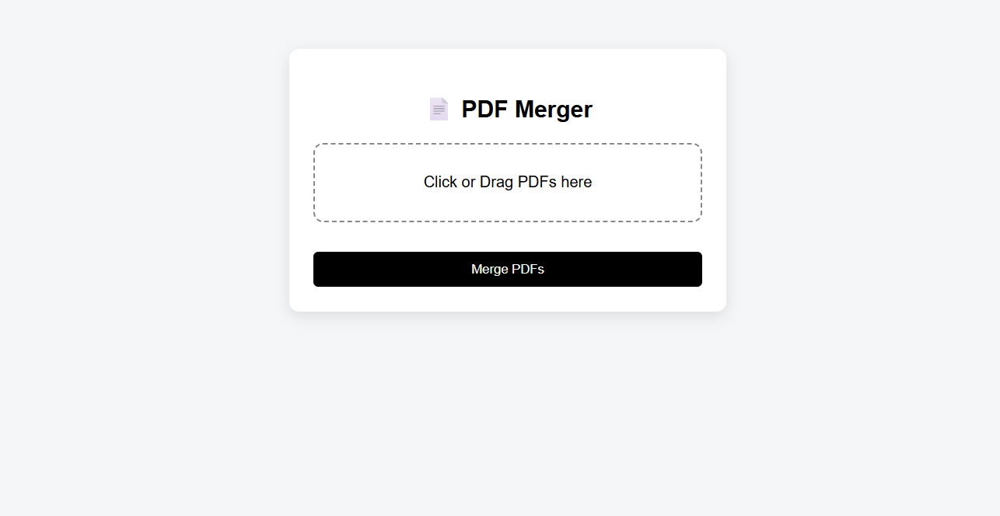
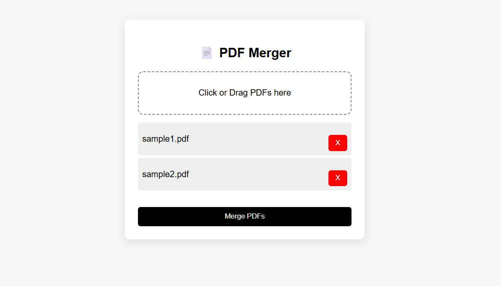
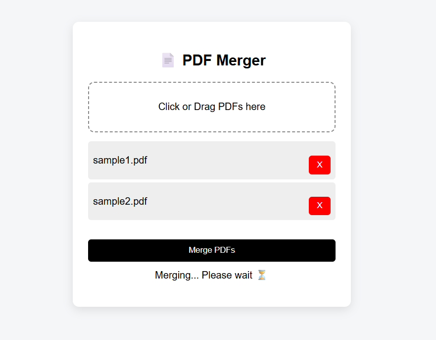
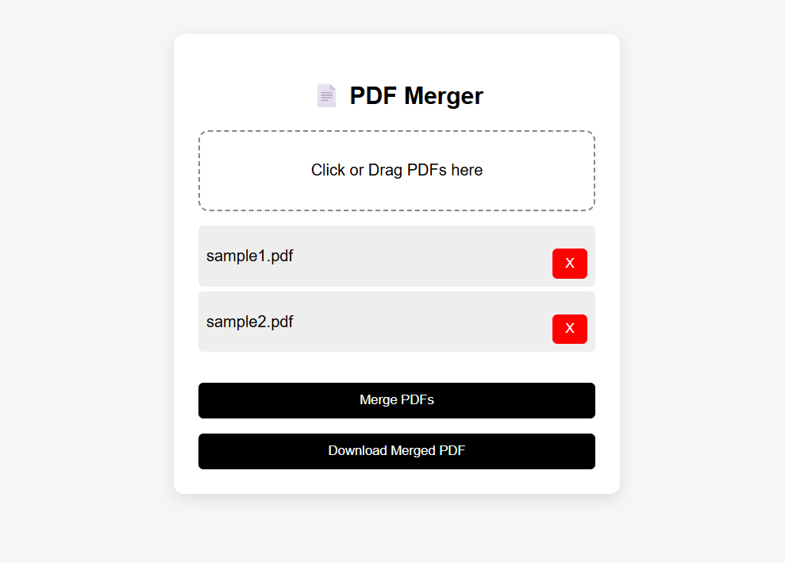

# 📄 PDF Merger Web App

A simple and efficient web application that allows users to upload multiple PDF files and merge them into a single document.

🔗 **Live Demo:** https://pdf-merger-94uu.onrender.com/

---

## 🚀 Features

- 📂 Upload multiple PDF files
- 🔀 Merge PDFs into one file
- ⏳ Loading indicator during processing
- ⬇️ Download merged PDF
- 🖱️ Drag & drop file selection
- ❌ Remove files before merging

---

## 🛠️ Tech Stack

- **Frontend:** HTML, CSS, JavaScript  
- **Backend:** Python (Flask)  
- **Library:** pypdf  
- **Deployment:** Render  

---

## 📸 Screenshots

### Before Upload Interface

### After Upload Interface

### While Merging Interface

### Download Merged PDFs Interface

---

## ⚙️ How to Run Locally

### 1. Clone the repository
git clone https://github.com/HarshSaxena479/pdf-merger.git  
cd pdf-merger
### 2. Install Dependencies
pip install -r requirements.txt
### 3. Run the app
python app.py
### 4. Open in browser

---

## 👨‍💻 Author

Harsh Saxena  
GitHub: https://github.com/HarshSaxena479
